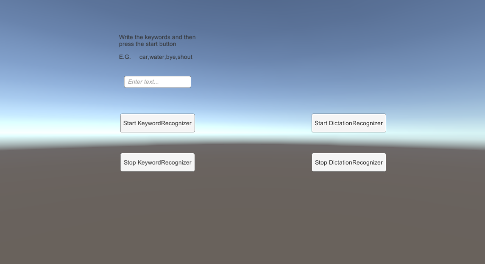
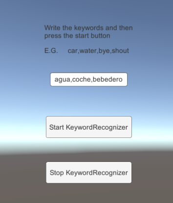
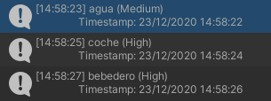
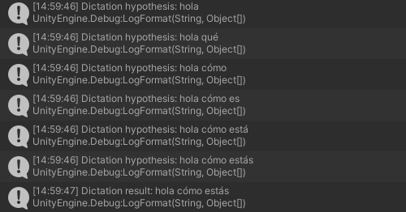

# ReconocimientoVoz_CristianRodriguezNavarro



La aplicación visualmente es bastante sencilla, un input field para recojer las palabras claves y botones para empezar y parar los servicios de voz.  
  
La clase de KeywordRecognizer  

```c#
public class Listener : MonoBehaviour
{
    [SerializeField] private string[] m_Keywords;
    [SerializeField] InputField input;
    private KeywordRecognizer m_Recognizer;

    void Start()
    {
        input.onEndEdit.AddListener(KeywordArrayMaker);
    }

    private void OnPhraseRecognized(PhraseRecognizedEventArgs args)
    {
        StringBuilder builder = new StringBuilder();
        builder.AppendFormat("{0} ({1}){2}", args.text, args.confidence, Environment.NewLine);
        builder.AppendFormat("\tTimestamp: {0}{1}", args.phraseStartTime, Environment.NewLine);
        builder.AppendFormat("\tDuration: {0} seconds{1}", args.phraseDuration.TotalSeconds, Environment.NewLine);
        Debug.Log(builder.ToString());
    }

    private void KeywordArrayMaker(string arg)
    {
        m_Keywords = arg.Split(',');
    }

    public void StartKeyword()
    {
        m_Recognizer = new KeywordRecognizer(m_Keywords);
        m_Recognizer.OnPhraseRecognized += OnPhraseRecognized;
        m_Recognizer.Start();
    }

    public void StopKeyword()
    {
        m_Recognizer.Stop();
        m_Recognizer.Dispose();
        PhraseRecognitionSystem.Shutdown();
    }
}
```  

La clase de DictationRecognizer
```c#
public class Dict : MonoBehaviour
{
    [SerializeField]
    private Text m_Hypotheses;

    [SerializeField]
    private Text m_Recognitions;

    private DictationRecognizer m_DictationRecognizer;

    void Start()
    {
        m_DictationRecognizer = new DictationRecognizer();

        m_DictationRecognizer.DictationResult += (text, confidence) =>
        {
            Debug.LogFormat("Dictation result: {0}", text);
            m_Recognitions.text += text + "\n";
        };

        m_DictationRecognizer.DictationHypothesis += (text) =>
        {
            Debug.LogFormat("Dictation hypothesis: {0}", text);
            m_Hypotheses.text += text;
        };

        m_DictationRecognizer.DictationComplete += (completionCause) =>
        {
            if (completionCause != DictationCompletionCause.Complete)
                Debug.LogErrorFormat("Dictation completed unsuccessfully: {0}.", completionCause);
        };

        m_DictationRecognizer.DictationError += (error, hresult) =>
        {
            Debug.LogErrorFormat("Dictation error: {0}; HResult = {1}.", error, hresult);
        };

    }

    public void StartDict()
    {
        m_DictationRecognizer.Start();
    }

    public void StopDict()
    {
        m_DictationRecognizer.Stop();
        m_DictationRecognizer.Dispose();
    }
}
```

## Ejemplos de funcionamiento  
  
  
  
